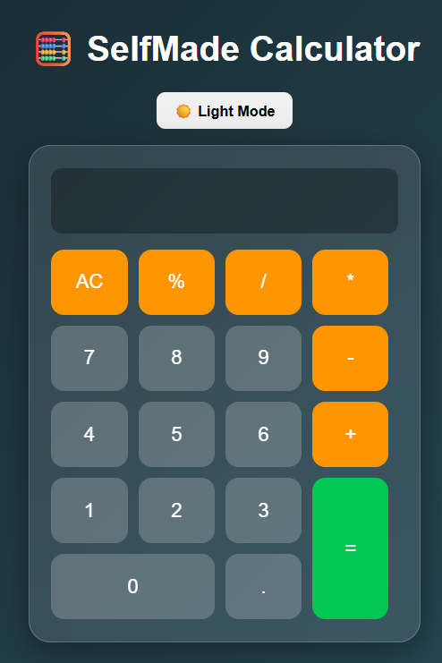
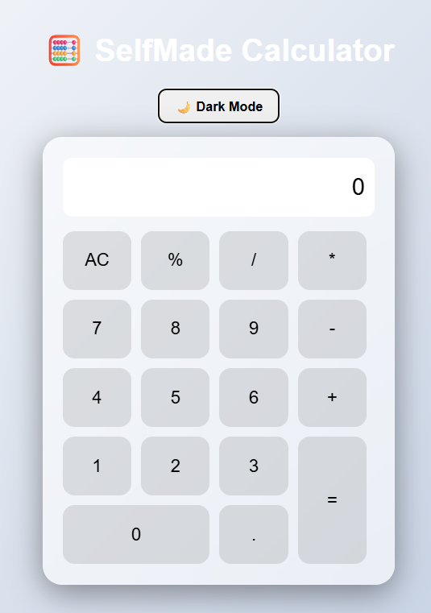

# 🧮 Self-made Calculator

A modern Calculator built using **HTML, CSS, and JavaScript** with a beautiful glassmorphism design.

## 🚀 Features

- Dark / Light Mode Toggle
- Button Click Sound Effects
- Keyboard Support
- Responsive Design
- Glassmorphism UI
- Error Handling

## 🛠️ Technologies Used

- HTML5
- CSS3
- JavaScript (Vanilla JS)

## 🎯 What I Learned

While building this project I learned:

- DOM Manipulation
- Event Listeners in JavaScript
- Creating interactive UI components
- Handling keyboard input
- Designing responsive layouts

## 📸 Project Screenshot

### Dark Mode

### Light Mode

## 🌐 Live Demo
https://kaushikshivam-stack.github.io/selfmade-calculator/

## 👨‍💻 Author

Shivam K@ushik
---
⭐ If you like this project, feel free to star the repository.
